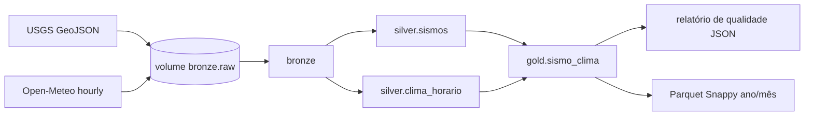

# Diagramas

## Fluxo de dados
Visão geral do medalhão proposto.

```mermaid
flowchart LR
  U[USGS GeoJSON] --> V[(volume bronze.raw)]
  M[Open-Meteo hourly] --> V
  V --> B[bronze]
  B --> S1[silver.sismos]
  B --> S2[silver.clima_horario]
  S1 --> G[gold.sismo_clima]
  S2 --> G
  G --> Q[relatório de qualidade JSON]
  G --> P[Parquet Snappy ano/mês]
```
